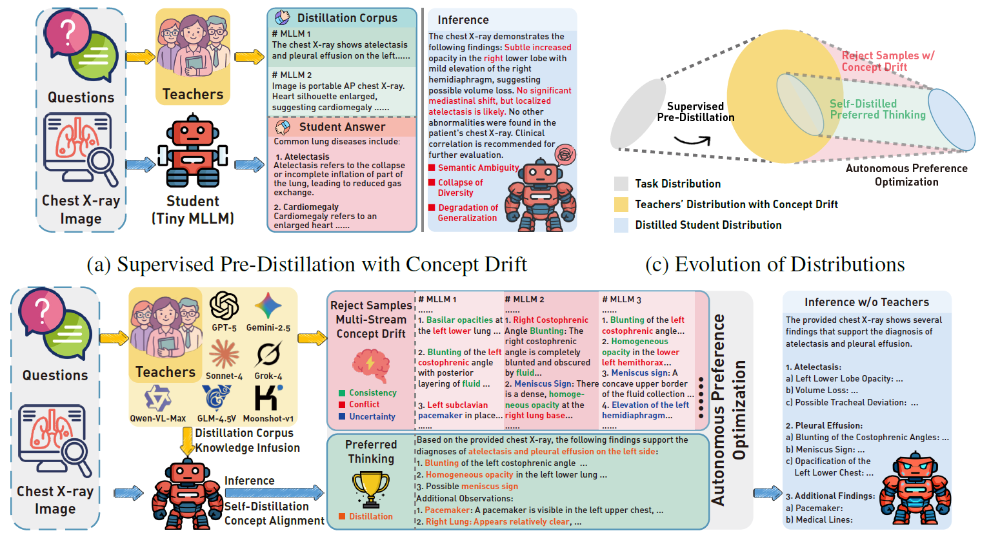

# Autonomous Distillation


This repository is a PyTorch implementation of Autonomous Preference Optimization proposed in *Learning from All: Concept Alignment for Autonomous Distillation from Multiple Drifting MLLMs* (submitted)

This paper identifies a critical yet underexplored challenge in distilling from multi-modal large language models (MLLMs): the reasoning trajectories generated by multiple drifting teachers exhibit concept drift, whereby their reasoning distributions evolve unpredictably and transmit biases to the student model, ultimately compromising its performance. To tackle this issue, we pioneer a theoretical connection between concept drift and knowledge distillation, casting the non-stationary reasoning dynamics from multiple MLLM teachers as next-token prediction of multi-stream reasoning trajectories. Guided by concept drift, we introduce the “learn–compare–critique” paradigm, culminating in autonomous preference optimization (APO). Under the active guidance of the teachers, the student model first learns and self-distils preferred thinking by comparing multiple teachers. It then engages in critical reflection over the drifting inference from teachers, performing concept alignment through APO, ultimately yielding a robust, consistent, and generalizable model. Extensive experiments demonstrate our superior performance of consistency, robustness and generalization within knowledge distillation. Besides, we also contributed a large-scale dataset CXR-MAX (Multi-teachers Alignment X-rays), comprising 170,982 distilled reasoning trajectories derived from publicly accessible MLLMs based on MIMIC-CXR. 


The code in this repo is copied/modified from [Qwen2.5-VL](https://github.com/QwenLM/Qwen2.5-VL).



The main contributions of our methods:

- We establish a novel theoretical framework that casts the autoregressive generation of reasoning trajectories in MLLMs within the perspective of concept drift theory, providing a principled foundation for understanding and analyzing knowledge distillation from multiple drifting teachers.

- Second, building on the foundation of concept drift theory, we design an autonomous distillation framework that follows a “learn–compare–critique” paradigm, where the student first acquires broad domain-specific knowledge from diverse drifting teachers, then performs self-distillation to align their concepts, and finally employs autonomous preference optimization to reconcile biases and reinforce generalization.

- Third, we conduct comprehensive empirical evaluations on diverse clinical benchmarks for chest radiographs, including disease classification, diagnostic report generation, and zero-shot generalization. Despite relying on only one-tenth of the distillation data typically required, our method consistently delivers statistically significant gains in robustness, generalization, and accuracy under multiple drifting MLLM teachers. Furthermore, ablation studies substantiate the effectiveness of each component of our framework.

- As a pioneer contribution to the community, we introduce CXR-MAX (\textbf{M}ulti-teahers \textbf{A}lignment \textbf{X}-rays), a large-scale dataset comprising  170,982 distillation results of reasoning trajectories derived from publicly accessible MLLMs based on MIMIC-CXR. 

-----------------------------------------------

## Training

The supervised-fining (SFT) and reinforced fine-tuning (RFT) are supported by [ms-swift](https://github.com/modelscope/ms-swift)

To supervised-fine the Qwen2.5-VL with multi-node distributed training, run the following with 2 GPUs:

```bash
nohup bash SFT-Qwen2.5.sh > sft.log 2>&1 &
```

To reinforced fine-tune the Qwen2.5-VL with multi-node distributed training, run the following with 2 GPUs:


```bash
nohup bash APO-Qwen2.5.sh > cpo.log 2>&1 &
```


## CXR-MAX (**M**ulti-teachers **A**lignment for **X**-rays) Dataset


Since we are pioneers in introducing the concept drift into the knowledge distillation of multiple MLLMs, we are deeply aware of the scarcity of multiple CoT from various MLLMs in downstream tasks, especially in the highly professional medical field. Consequently, we aim for the model to autonomously adapt to concept drift, selectively assimilating consistent and valuable knowledge from multiple teachers while preventing the inheritance of biases during distillation.

In this context, to rigorously evaluate the potential of a student model trained under multiple drifting teachers, a more realistic training dataset for knowledge distillation is essential. Addressing the need for high-quality chain-of-thought (CoT) data from diverse MLLMs, we introduce CXR-MAX (**M**ulti-teachers **A**lignment for **X**-rays), an extension of the  [MIMIC-CXR](https://physionet.org/content/mimic-cxr/2.1.0/) dataset incorporating outputs from seven widely used public MLLMs. CXR-MAX provides 170,982 distillation instances of reasoning trajectories covering 14 thoracic pathologies, establishing the first large-scale benchmark for knowledge distillation in clinical chest X-ray interpretation. 


We have upload this dataset on [huggingface](https://huggingface.co/datasets/MiaoMiaoYang/CXR-MAX), you can download using this command:

```
git clone https://huggingface.co/datasets/MiaoMiaoYang/CXR-MAX
```
